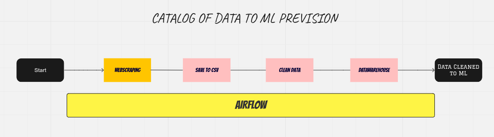
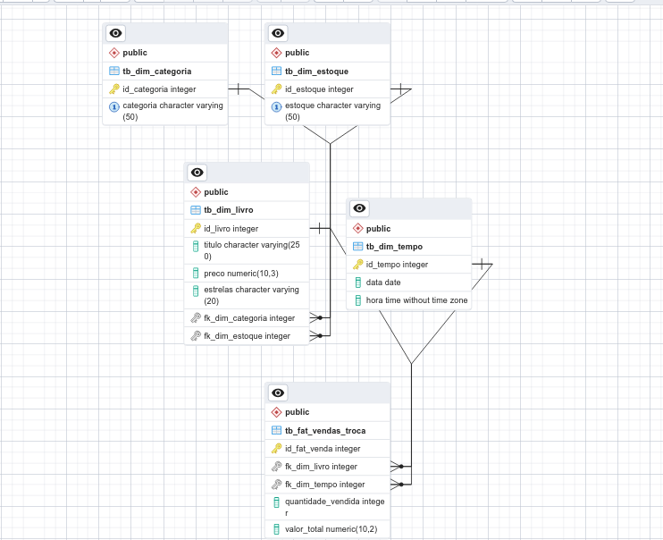
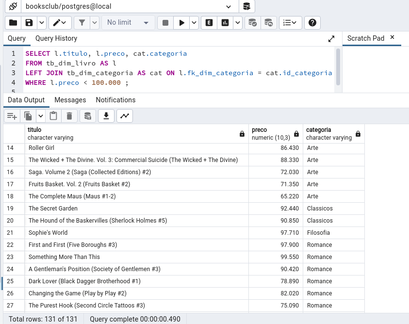
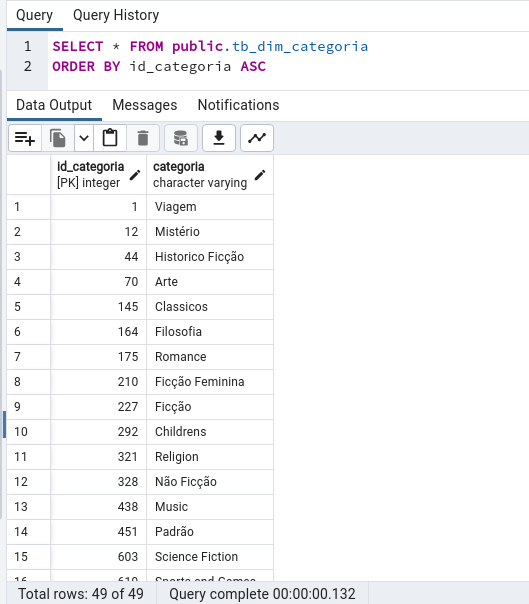
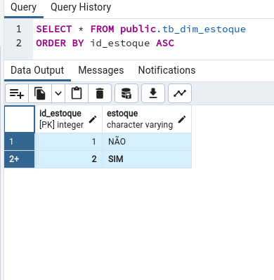
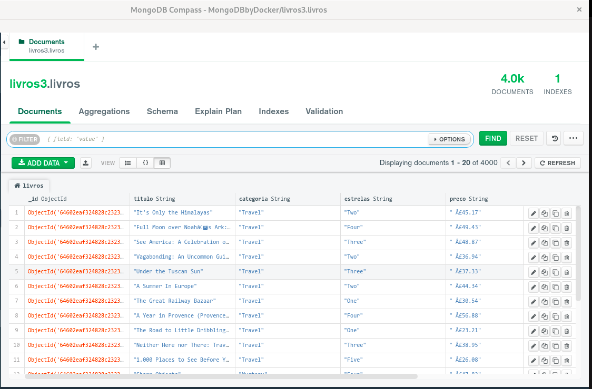

# Project Books Club
## Desafio para aprendizagem de Eng de dados: Coleta de Dados, Limpeza de Dados, Exploração de Dados e Armazenamento dos dados

### Cenário hipotético:
A Book Club é uma Startup de troca de livros. O modelo de negócio funciona com base na troca de livros pelos usuários, cada livro cadastrado pelo usuário, dá o direito à uma troca, porém o usuário também pode comprar o livro, caso ele não queira oferecer outro livro em troca. A empresa pretende fazer um sistema de recomendação. Mas a Book Club não coleta e nem armazena os livros enviados pelos usuários. Antes de construir um sistema de recomendação é precisa coletar e armazenar os dados do site.

### Ideia para solução
#### 
+ Coletar dados no site para um futuro sistema de recomendação da empresa ficticia BOOKS CLUB, por webscraping.
+ Dados Extraídos -> Livro: Titulo, Preco, Estrelas, Categoria, Estoque (Em moeda estrangeira e idioma estrangeiro)
+ Disponibilizar dado bruto em arquivo(CSV) (Adendo: No MongoDB)
+ Tratar os dados
+ Criar Datawarehouse (Modelagem Dimensional e Postgres)
+ Salvar dados limpos em csv e enviar para o Datawarehouse
+ Automatizar tarefa com airflow

### Ferramentas:
+ Beautifulsoup4
+ Python
+ Airflow
+ Postgres, PGADMIN
+ SQL
+ ETL
+ Miro

#### Modelagem Dimensional 

#### Dado limpo no Postgres

#### Dado bruto no MongoDB

